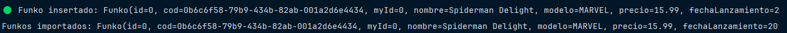
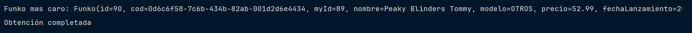
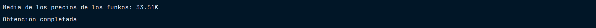
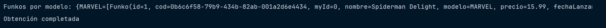
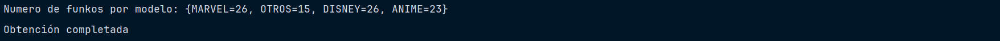
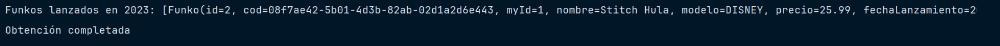
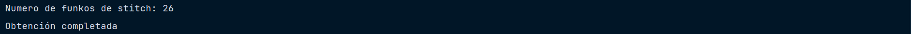
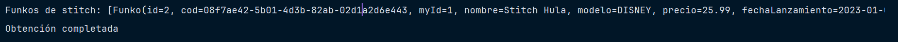

# ReacFunko

***
Es un simple proyecto de programación reactiva que utilizar Flux,Mono y R2DBC para no bloquear el hilo principal de la
aplicación. A continuación, se describen los pasos para ejecutar el proyecto.

# Requisitos

***

* Java 8 o superior
* Gradle

# Configuración

***

1. Configuración de las dependencias

* Se debe agregar el repositorio de Spring Milestone en el archivo build.gradle

``` Gradle
plugins {
    id("java")
}
group = "org.example"
version = "1.0-SNAPSHOT"
repositories {
    mavenCentral()
}
dependencies {
    // Project Reactor
    implementation("io.projectreactor:reactor-core:3.5.10")
    // R2DBC
    implementation("io.r2dbc:r2dbc-h2:1.0.0.RELEASE")
    implementation("io.r2dbc:r2dbc-pool:1.0.0.RELEASE")
    // Para nuestros test
    testImplementation(platform("org.junit:junit-bom:5.9.2"))
    testImplementation("org.junit.jupiter:junit-jupiter:5.9.2")
    // Logger
    implementation("ch.qos.logback:logback-classic:1.4.11")
    // Lombook para generar código, poner todo esto para que funcione
    implementation("org.projectlombok:lombok:1.18.28")
    testImplementation("org.projectlombok:lombok:1.18.28")
    annotationProcessor("org.projectlombok:lombok:1.18.28")
    // Ibatis lo usaremos para leer los scripts SQL desde archivos
    implementation("org.mybatis:mybatis:3.5.13")
    // H2, solo usa una
    implementation("com.h2database:h2:2.1.214")
    // https://mvnrepository.com/artifact/com.google.code.gson/gson
    implementation("com.google.code.gson:gson:2.10.1")
    // Mockito para nuestros test con JUnit 5
    testImplementation("org.mockito:mockito-junit-jupiter:5.5.0")
    testImplementation("org.mockito:mockito-core:5.5.0")
}
```

2. Configuración de la base de datos

* Vamos a configura la base de datos, para ello vamos a crear un archivo llamado database.properties en la carpeta,
   que es para guardar las propiedades de la base de datos.

``` properties
# configuracion de la base de datos
database.url=r2dbc:h2:file:///./funkos
database.user=sa
database.password=
database.initTables=true
```

3. Configuración de la conexión a la base de datos

* Vamos a crear la clase ```DatabaseManager``` nos permiete manejar la conexión a la base de datos y la inicialización
de las tablas.

``` java
    public static synchronized DatabaseManager getInstance() {
        if (instance == null) {
            instance = new DatabaseManager();
        }
        return instance;
    }

    // Constructor privado
    private DatabaseManager() {
        loadProperties();

        connectionFactory = ConnectionFactories.get(databaseUrl);

        ConnectionPoolConfiguration configuration = ConnectionPoolConfiguration.builder(connectionFactory).maxIdleTime(Duration.ofMillis(1000)).maxSize(20).build();
        pool = new ConnectionPool(configuration);

        if (databaseInitTables) {
            initTables();
        }
    }

    // Métodos que ejecuta los scripts de la base de datos
    public synchronized void initTables() {
        logger.debug("Borrando tablas si existe");
        excuteScript("remove.sql").block();
        logger.debug("Creando tablas");
        excuteScript("init.sql").block();
    }

    /**
     * Ejecuta un script
     *
     * @param script script a ejecutar
     * @return void
     */
    private Mono<Void> excuteScript(String script) {
        logger.debug("Ejecutando script: " + script);
        return Mono.usingWhen(connectionFactory.create(), connection -> {
            logger.debug("Creando conexión con la base de datos");
            String scriptContent = null;
            try {
                try (InputStream inputStream = getClass().getClassLoader().getResourceAsStream(script)) {
                    if (inputStream == null) {
                        return Mono.error(new IOException("No se ha encontrado el fichero de scrript"));
                    } else {
                        try (BufferedReader reader = new BufferedReader(new InputStreamReader(inputStream))) {
                            scriptContent = reader.lines().collect(Collectors.joining("\n"));
                        }
                    }
                }
                logger.debug(scriptContent);
                Statement statement = connection.createStatement(scriptContent);
                return Mono.from(statement.execute());
            } catch (IOException e) {
                return Mono.error(e);
            }
        }, Connection::close).then();
    }

    // Métodos para cargar las propiedades de la base de datos
    private void loadProperties() {
        logger.debug("Cargando fichero de configuración de la base de datos");
        try {
            var configFile = ClassLoader.getSystemResource("database.properties").getFile();
            var props = new Properties();
            props.load(new FileReader(configFile));

            databaseUser = props.getProperty("database.user", "sa");
            databasePass = props.getProperty("database.password", "");
            databaseUrl = props.getProperty("database.url", "jdbc:h2:./funkos");
            databaseInitTables = Boolean.parseBoolean(props.getProperty("database.initTables", "false"));
            logger.debug("Configurado las properties correctamente");

        } catch (Exception e) {
            throw new RuntimeException(e);
        }
    }

    /**
     * Devuelve la conexión a la base de datos
     *
     * @return Connection de la base de datos
     */
    public ConnectionPool getConnectionPoll() {
        return this.pool;
    }
```

4. Crear la clase Funko

* Creamos la clase ```Funko```que es la que vamos a utilizar para guardar los datos de los funkos.

``` java
public class Funko {
    // Atributos
    private long id;
    private UUID cod;
    private long myId;
    private String nombre;
    private String modelo;
    private double precio;
    private LocalDate fechaLanzamiento;
    @Builder.Default
    private LocalDateTime created_at = LocalDateTime.now();
    @Builder.Default
    private LocalDateTime updated_at = LocalDateTime.now();
```

5. Crear la clase FunkoRepository

* Creamos la clase ```FunkoRepository```que es la que vamos a utilizar para guardar los datos de los funkos que implementa la interfaz ```CrudRepository``` y sobreescribe los methods de la interfaz.

``` java
public interface CrudRepository<T,ID> {
    // Metodos CRUD
    Flux<Funko> findAll();
    Mono<Funko> findById(ID id);
    Mono<Funko> save(T t);
    Mono<Funko> update(T t);
    Mono<Boolean> deleteById(ID id);
    Mono<Void> deleteAll();
}
```

```java
public interface FunkoRepository extends CrudRepository<Funko,Long> {
    // Metodos propios
    Flux<Funko> findByNombre(String nombre);
    Mono<Funko> findByUuid(UUID uuid);
}
```

```java
public class FunkoRepositoryImp implements FunkoRepository {
    // Atributos
    private static FunkoRepositoryImp instance;
    private final Logger logger = LoggerFactory.getLogger(FunkoRepositoryImp.class);
    private final ConnectionPool connectionFactory;

    // Constructor privado
    private FunkoRepositoryImp(DatabaseManager databaseManager) {
        this.connectionFactory = databaseManager.getConnectionPoll();
    }

    // Singleton
    public static FunkoRepositoryImp getInstance(DatabaseManager databaseManager) {
        if (instance == null) {
            instance = new FunkoRepositoryImp(databaseManager);
        }
        return instance;
    }
}
    // Sobreescribimos los metodos de la interfaz...
```
6. Crear la clase FunkoCache

* Creamos la clase ```FunkoCache```que es la que vamos a utilizar para guardar los datos de los funkos que implementa la interfaz ```CrudCache``` y sobreescribe los methods de la interfaz.

``` java
public interface Cache<K, V> {
    // Metodos CRUD
    Mono<Void> put(K key, V value);

    Mono<V> get(K key);

    Mono<Void> remove(K key);

    void clear();

    void shutdown();
}
```

```java
public interface FunkoCache extends Cache<Long, Funko> {

}
```

```java
public class FunkoCacheImp implements FunkoCache {
   // Atributos
   private Logger logger = LoggerFactory.getLogger(FunkoCacheImp.class);
   private final int maxSize;
   private final Map<Long, Funko> cache;
   private final ScheduledExecutorService cleaner;

   // Constructor
   public FunkoCacheImp(int maxSize) {
      this.maxSize = maxSize;
      this.cache = new LinkedHashMap<Long, Funko>(maxSize, 0.75f, true) {
         @Override
         protected boolean removeEldestEntry(Map.Entry<Long, Funko> eldest) {
            return size() > maxSize;
         }
      };
      this.cleaner = Executors.newSingleThreadScheduledExecutor();
      this.cleaner.scheduleAtFixedRate(this::clear, 1, 1, TimeUnit.MINUTES);
   }

   /**
    * Añade un funko a la cache
    *
    * @param key   clave
    * @param value valor
    * @return void
    */
   @Override
   public Mono<Void> put(Long key, Funko value) {
      logger.debug("Añadiendo funko a cache con id: " + key + " y valor: " + value);
      return Mono.fromRunnable(() -> cache.put(key, value));
   }

   /**
    * Obtiene un funko de la cache
    *
    * @param key clave
    * @return funko
    */
   @Override
   public Mono<Funko> get(Long key) {
      logger.debug("Obteniendo funko de cache con id: " + key);
      return Mono.justOrEmpty(cache.get(key));
   }

   /**
    * Elimina un funko de la cache
    *
    * @param key clave
    * @return void
    */
   @Override
   public Mono<Void> remove(Long key) {
      logger.debug("Eliminando funko de cache con id: " + key);
      return Mono.fromRunnable(() -> cache.remove(key));
   }

   /**
    * Limpia la cache
    *
    * @return void
    */
   @Override
   public void clear() {
      cache.entrySet().removeIf(entry -> {
         boolean shouldRemove = entry.getValue().getUpdated_at().plusSeconds(90).isBefore(LocalDateTime.now());
         if (shouldRemove) {
            logger.debug("Autoeliminando por caducidad funko de cache con id: " + entry.getKey());
         }
         return shouldRemove;
      });
   }

   /**
    * Cierra la cache
    */
   @Override
   public void shutdown() {
      cleaner.shutdown();
   }
}
```


7. Crear la clase FunkoService

* Creamos la clase ```FunkoService```que es la que vamos a utilizar para guardar los datos de los funkos que implementa la interfaz ```CrudFunkoService``` y sobreescribe los methods de la interfaz.

``` java
public interface CrudFunkoService {
    // Metodos CRUD
    Flux<Funko> findAll();

    Flux<Funko> findAllByNombre(String nombre);

    Mono<Funko> findById(long id);

    Mono<Funko> save(Funko alumno);

    Mono<Funko> update(Funko alumno);

    Mono<Funko> deleteById(long id);

    Mono<Void> deleteAll();
}
```

```java
public interface FunkoService extends CrudFunkoService {
    // Metodos propios
    Flux<Funko> importarCSV() throws FileNotFoundException;

    Mono<Void> exportarJSON() throws IOException;

    Mono<Funko> findByUuid(UUID uuid);

    Mono<Funko> funkoMasCaro();

    Mono<Double> mediaFunkos();

    Mono<Map<String, List<Funko>>> funkoPorModelo();

    Mono<Map<String, Integer>> numeroFunkosPorModelo();

    Mono<List<Funko>> funkosLanzadosEn2023();

    Mono<Integer> numeroFunkosStitch();

    Mono<List<Funko>> funkosStitch();

}
```

```java
public class FunkoServiceImp implements FunkoService {
    // Atributos
    private static FunkoServiceImp instance;
    private final Logger logger = LoggerFactory.getLogger(FunkoRepositoryImp.class);
    private final FunkoRepository funkoRepository;
    private final FunkosNotificacion notificacionFunko;
    private final FunkoCache cache;
    private final int MAX_SIZE = 15;

    // Constructor privado
    private FunkoServiceImp(FunkoRepository funkoReposotory) {
        this.funkoRepository = funkoReposotory;
        this.notificacionFunko = NotificacionFunkoImp.getInstance();
        this.cache = new FunkoCacheImp(MAX_SIZE);

    }

    /**
     * Singleton
     *
     * @param funkoReposotory repositorio
     * @return instancia
     */

    public static FunkoServiceImp getInstance(FunkoRepository funkoReposotory) {
        if (instance == null) {
            instance = new FunkoServiceImp(funkoReposotory);
        }
        return instance;
    }
}
    // Sobreescribimos los metodos de la interfaz...
```

8. Ejecutar el proyecto

* Ejecutamos el proyecto y comprobamos que funciona correctamente.

```java
public class Main {
    public static void main(String[] args) {
        var funkosService = FunkoServiceImp.getInstance(FunkoRepositoryImp.getInstance(DatabaseManager.getInstance()));
        var funkosNotification = NotificacionFunkoImp.getInstance();

        System.out.println("Sistema de obtención de notificaciones en Tiempo Real");
        funkosNotification.getNotificacionFunko().subscribe(
                notificacion -> {
                    switch (notificacion.tipo()) {
                        case NEW:
                            System.out.println("🟢 Funko insertado: " + notificacion.contenido());
                            break;
                        case UPDATED:
                            System.out.println("🟠 Funko actualizado: " + notificacion.contenido());
                            break;
                        case DELETED:
                            System.out.println("🔴 Funko eliminado: " + notificacion.contenido());
                            break;
                    }
                },
                error -> System.err.println("Se ha producido un error: " + error),
                () -> System.out.println("Completado")
        );
        funkosService.importarCSV().subscribe(
                funkos -> System.out.println("Funkos importados: " + funkos),
                error -> System.out.println("Error al importar los funkos: " + error.getMessage()),
                () -> System.out.println("Importación completada")
        );
        System.out.println("Funko mas caro");
        funkosService.funkoMasCaro().subscribe(
                funkoMasCaro -> System.out.println("Funko mas caro: " + funkoMasCaro),
                error -> System.out.println("Error al obtener el funko mas caro: " + error.getMessage()),
                () -> System.out.println("Obtención completada")
        );

        System.out.println("Media de los precios de los funkos");
        funkosService.mediaFunkos().subscribe(
                mediaFunkos -> System.out.println("Media de los precios de los funkos: " + mediaFunkos),
                error -> System.out.println("Error al obtener la media de los precios de los funkos: " + error.getMessage()),
                () -> System.out.println("Obtención completada")
        );

        System.out.println("Funkos por modelo");
        funkosService.funkoPorModelo().subscribe(
                funkoPorModelo -> System.out.println("Funkos por modelo: " + funkoPorModelo),
                error -> System.out.println("Error al obtener los funkos por modelo: " + error.getMessage()),
                () -> System.out.println("Obtención completada")
        );

        System.out.println("Numero de funkos por modelo");
        funkosService.numeroFunkosPorModelo().subscribe(
                numeroFunkosPorModelo -> System.out.println("Numero de funkos por modelo: " + numeroFunkosPorModelo),
                error -> System.out.println("Error al obtener el numero de funkos por modelo: " + error.getMessage()),
                () -> System.out.println("Obtención completada")
        );

        System.out.println("Funkos lanzados en 2023");
        funkosService.funkosLanzadosEn2023().subscribe(
                funkos2023 -> System.out.println("Funkos lanzados en 2023: " + funkos2023),
                error -> System.out.println("Error al obtener los funkos lanzados en 2023: " + error.getMessage()),
                () -> System.out.println("Obtención completada")
        );
        System.out.println("Numero de funkos de stitch");
        funkosService.numeroFunkosStitch().subscribe(
                numeroFunkos -> System.out.println("Numero de funkos de stitch: " + numeroFunkos),
                error -> System.out.println("Error al obtener el numero de funkos de stitch: " + error.getMessage()),
                () -> System.out.println("Obtención completada")
        );
        System.out.println("Funkos de stitch");
        funkosService.funkosStitch().subscribe(
                funkosStitch -> System.out.println("Funkos de stitch: " + funkosStitch),
                error -> System.out.println("Error al obtener los funkos de stitch: " + error.getMessage()),
                () -> System.out.println("Obtención completada")
        );
        System.exit(0);
    }
}
```








